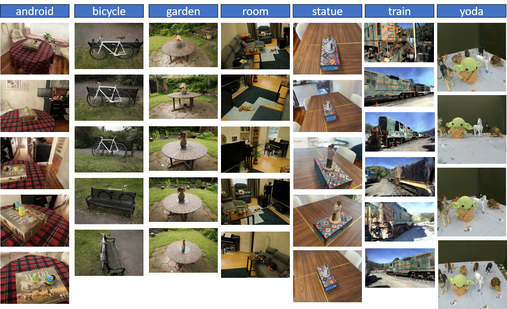

<p align="center">
  <h1 align="center"><strong>   FastSplatting: SfM free Ultra Fast Gaussian Splatting</strong></h1>

  <p align="center">
    <em>DeparDepartment of Engineering Sciences, University of Agder, Norway</em>
  </p>

</p>
<div id="top" align="center">

[](http://arxiv.org/)
[](https://github.com/anurag-dalal/FastSplatting)

</div>

<div align="center">
    
</div>

## 📰 News
**[2025.10.26]** Code of VGGT-X had been released!

**[2025.09.30]** Paper release of our VGGT-X on arXiv!

## 🔎 Purpose
Instructions to run training and batch runs using
`training.py` and `train_all.py` included in this repo. Also visualize using `simple_viewer.py`

## ⚡ Quick Start
This project uses miniconda to install dependencies. CUDA 12.1 is used on a RTX 4090 GPU.
First, clone this repository to your local machine, and install the dependencies. 

```bash
git clone --recursive https://github.com/anurag-dalal/FastSplatting.git 
cd FastSplatting
conda env create -f environment.yml
conda activate FastSplatting
pip install -r requirements.txt
```

**Minimal example commands**:
- **Single-GPU training**: run a config (named `default` or `mcmc`) using the bundled tyro CLI configs.

```bash
CUDA_VISIBLE_DEVICES=0 python training.py default
```

- **Distributed (multi-GPU) training**: expose multiple GPUs and scale steps accordingly.

```bash
CUDA_VISIBLE_DEVICES=0,1,2,3 python training.py default --steps_scaler 0.25
```

- **Evaluate from checkpoint only**: pass `--ckpt` (can be a list) to evaluate saved weights.

```bash
python training.py default --ckpt /path/to/ckpt_rank0.pt
```

**Batch runs using `train_all.py`**:
- `train_all.py` is a convenience helper that iterates a list of dataset folders and result directories, runs the training (`training.main`) sequentially, then collects evaluation metrics (PSNR/SSIM/LPIPS) and computes an L1 between saved renders and source images.
- Edit the `DATASET_DIRS` / `result_dir_base` variables at the top of `train_all.py` to point to your datasets and desired output base. Then run:

```bash
python train_all.py
```

After a run, outputs are written under each `results/<scene>/` with the following subfolders:
- `ckpts/`  : saved model checkpoints
- `stats/`  : JSON metrics recorded during training / eval
- `renders/`: rendered images from eval steps
- `tb/`     : TensorBoard logs

`train_all.py` also writes a summary CSV `train_all_metrics.csv` to the configured result directory base including PSNR/SSIM/LPIPS/L1 and runtime/memory fields.

**Important runtime/config notes**:
- Configuration is driven by the `Config` dataclass in `training.py`. Two named presets are provided: `default` and `mcmc`.
- Common config knobs you may want to override on the CLI: `--data_dir`, `--result_dir`, `--data_factor`, `--steps_scaler`, `--max_steps`, and `--ckpt`.
- `training.py` uses a small internal server/viewer which is disabled automatically in distributed mode or when `cfg.disable_viewer=True`.

Thanks to [VGGT-X](https://github.com/Linketic/VGGT-X) and [3RGS](https://github.com/zsh523/3rgs)
